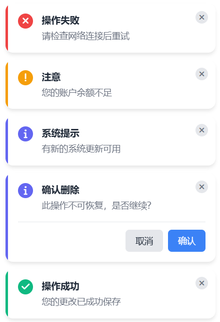

# YDMessage 消息通知组件

一个轻量级、现代化的消息通知组件，支持多种类型的消息提示、自定义位置和交互操作。

## 目录

- [特性](#特性)
- [安装](#安装)
- [基础用法](#基础用法)
- [API](#api)
- [配置选项](#配置选项)
- [主题定制](#主题定制)
- [示例](#示例)

## 特性

- 🎨 支持多种消息类型（成功、错误、警告、信息）

- 📍 灵活的位置控制

- ⚡️ 流畅的动画效果

- 🎯 支持交互确认

- 🌈 可自定义主题

- 📱 响应式设计

  

## 安装

1. 引入样式文件、引入 JS 文件：

```html
<link rel="stylesheet" href="https://cdnjs.cloudflare.com/ajax/libs/font-awesome/6.0.0/css/all.min.css">
<link rel="stylesheet" href="./ydmessage.css">
<script src="./ydmessage.js"></script>
```


## 基础用法

```javascript
// 成功提示
YDMessage.success('操作成功', '您的更改已成功保存');
// 错误提示
YDMessage.error('操作失败', '请检查网络连接后重试');
// 警告提示
YDMessage.warning('注意', '您的账户余额不足');
// 信息提示
YDMessage.info('系统提示', '有新的系统更新可用');
// 确认提示
YDMessage.confirm('确认删除', '此操作不可恢复，是否继续？', {
confirm: () => console.log('用户确认'),
cancel: () => console.log('用户取消')
});
```


## API

### 静态方法

- `YDMessage.success(title, message?, options?)`
- `YDMessage.error(title, message?, options?)`
- `YDMessage.warning(title, message?, options?)`
- `YDMessage.info(title, message?, options?)`
- `YDMessage.confirm(title, message?, options?)`

## 配置选项

| 参数 | 类型 | 默认值 | 说明 |
|------|------|--------|------|
| position | string | 'top-right' | 消息显示位置，可选值：'top-right'、'top-left'、'bottom-right'、'bottom-left' |
| duration | number | 4000 | 显示时间，单位毫秒，设为 0 则不自动关闭 |
| showClose | boolean | true | 是否显示关闭按钮 |
| autoClose | boolean | true | 是否自动关闭 |
| onClose | function | null | 关闭时的回调函数 |
| onClick | function | null | 点击消息时的回调函数 |

## 主题定制

通过修改 CSS 变量来自定义主题：

```css
:root {
/ 主题色 /
--primary: #3b82f6;
--success: #10b981;
--warning: #f59e0b;
--error: #ef4444;
--info: #6366f1;
/ 中性色 /
--bg: #ffffff;
--text: #1f2937;
--text-light: #6b7280;
--border: #e5e7eb;
}
```


## 示例

### 自定义位置
```javascript
YDMessage.success('自定义位置', '显示在左上角', {
position: 'top-left'
});
```


### 禁用自动关闭
```javascript
YDMessage.info('持续显示', '该消息不会自动关闭', {
autoClose: false
});
```


### 自定义回调
```javascript
YDMessage.success('操作成功', '点击查看详情', {
onClick: () => {
console.log('消息被点击');
},
onClose: () => {
console.log('消息被关闭');
}
});
```

